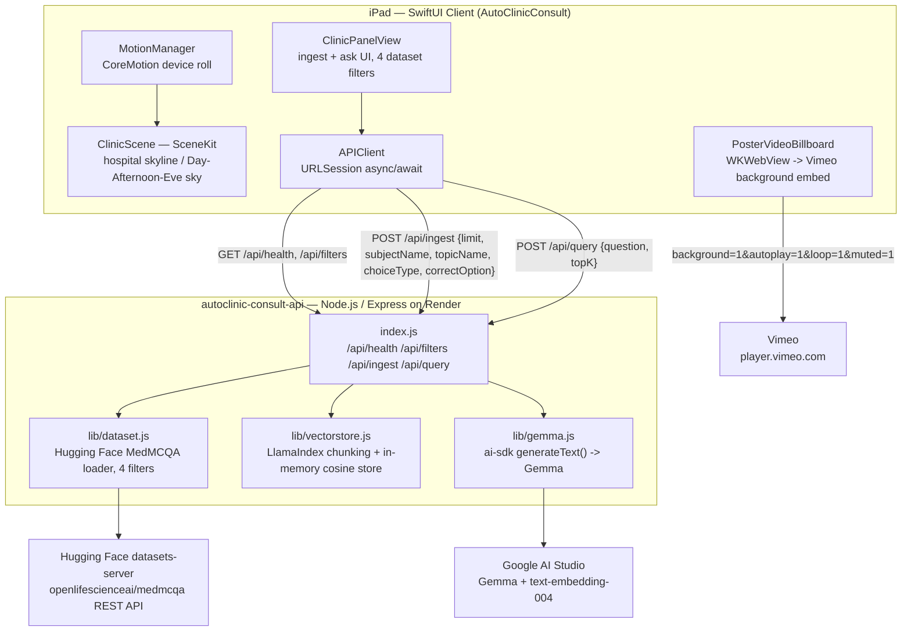

# AutoClinic Consult — SwiftUI Hospital Dashboard + Gemma RAG Backend

A SwiftUI + SceneKit iPad client for the **autoclinic-consult-api** Gemma RAG
backend, staged as an interactive 3D hospital-campus dashboard — motion-tilt
parallax, a Day/Afternoon/**Eve** skyline of procedural hospital towers (each
built from exactly **20** small elements), and a poster that turns into a
looping video while the tablet is in motion. Under the hood it calls a
**Node.js / Express** API — deployable to **Render** — source at
[`autoclinic-consult-api/`](./autoclinic-consult-api) — which ingests a
filtered slice of the **MedMCQA** medical Q&A dataset directly from Hugging
Face, indexes it in an **in-memory vector store (no ChromaDB)**, and answers
questions using a **Gemma** model called through the **Vercel AI SDK
(ai-sdk)**.

---

## Table of contents

- [Tech stack](#tech-stack)
- [Architecture](#architecture)
  - [System overview](#system-overview)
  - [SwiftUI client layer](#swiftui-client-layer)
  - [Node.js backend — autoclinic-consult-api](#nodejs-backend--autoclinic-consult-api)
  - [How data is fetched](#how-data-is-fetched)
- [Repository structure](#repository-structure)
- [Features](#features)
- [The 20 hospital elements](#the-20-hospital-elements)
- [Day / Afternoon / Eve sky](#day--afternoon--eve-sky)
- [Setup and build — SwiftUI app (.ipa via Apple Configurator)](#setup-and-build--swiftui-app-ipa-via-apple-configurator)
- [Setup and deploy — Node.js backend (Render)](#setup-and-deploy--nodejs-backend-render)
- [Jupyter notebook](#jupyter-notebook)

---

## Tech stack

- **Client platform:** macOS, Xcode 15+, Apple Configurator
- **UI framework:** SwiftUI (`@StateObject`/`@State` reactivity)
- **3D scene:** SceneKit — procedural hospital towers, dashboard panel node
- **Motion input:** CoreMotion (`CMMotionManager`) — device roll drives scene lean + parallax
- **Video embed:** WKWebView loading Vimeo's background-mode embed (muted, looping, autoplay)
- **Networking:** `URLSession` (async/await) against the deployed Node.js API
- **Backend:** Node.js / Express, deployed to **Render**
- **RAG stack:** Hugging Face `datasets-server` REST API → in-memory chunk store (cosine similarity) → Gemma via Vercel AI SDK
- **Notebook:** Jupyter (`gemma-rag-medical.ipynb`) — prototype of the same RAG pipeline in Python

---

## Architecture

### System overview

The SwiftUI app is a pure **consumer** of the Node.js backend's HTTP API — it
holds no model weights, no vector store, and no dataset locally. Everything
RAG-related (retrieval, embedding, generation) happens server-side; the
client's job is motion input, 3D rendering, and rendering whatever JSON comes
back from `/api/*`.



---

| Layer | Contract | Why it's isolated this way |
| --- | --- | --- |
| SwiftUI ↔ Node | `POST /api/ingest {limit, subjectName?, topicName?, choiceType?, correctOption?} → {message, recordsIngested, chunksIngested, sample}`; `POST /api/query {question, topK} → {answer, provider, model, sources[]}` | The client never touches Hugging Face or Gemma directly — it only speaks the same JSON contract `public/index.html` already used, so the web dashboard and the native app are interchangeable frontends for one backend |
| Node ↔ Hugging Face | `datasets-server` REST `rows` endpoint, filtered client-side on `subject_name`, `topic_name`, `choice_type`, and a `cop`-derived `correctOption` | No dataset is bundled with either the backend or the SwiftUI app — records are fetched live on each ingest call |
| Node ↔ in-memory store | LlamaIndex.TS `SentenceSplitter` chunks → `ai-sdk embed()` (`text-embedding-004`) → plain JS array + cosine similarity | No ChromaDB — embeddings and chunking stay entirely server-side and in-process; the SwiftUI app never sees raw vectors, only the final ranked `sources[]` |
| Node ↔ Gemma | `ai-sdk generateText()` against Google AI Studio's Generative Language API | Swappable model id (`GEMMA_MODEL` env var) without any client-side change |
| SwiftUI ↔ Vimeo | Direct `WKWebView` load of `player.vimeo.com/video/{id}?background=1` | Video playback is entirely client-side and unrelated to the RAG backend |

---

### SwiftUI client layer

- **`MotionManager`** — reads `CMDeviceMotion.attitude.roll`, low-pass
  filters it into `leanAngle`, and derives a boolean `isMoving`. This signal
  drives the panel's 3D lean and the poster↔video swap.
- **`ClinicScene`** — owns the `SCNScene`: procedural hospital towers (each
  built from exactly 20 small elements — see below), a floor plane, and
  `setTimeOfDay(_:)` for the Day/Afternoon/**Eve** lighting + sky presets
  (sun + clouds by day/afternoon, moon + clouds at eve).
- **`ClinicPanelView`** — the functional UI: Day/Afternoon/Eve picker, four
  dataset filter pickers (Subject, Topic, Choice type, Correct option),
  ingest button, question field, and cited answer list.
- **`APIClient`** — thin async/await wrapper matching `index.js`'s exact
  response shapes.
- **`HomeContactView`** — Home/Connect circles opening a sheet with
  LinkedIn/Vimeo/GitHub links.

---

### Node.js backend — autoclinic-consult-api

```
Hugging Face (openlifescienceai/medmcqa)
        │  datasets-server REST API
        ▼
  lib/dataset.js  ── fetch + filter (subjectName, topicName, choiceType, correctOption)
        ▼
  lib/vectorstore.js
        │  LlamaIndex SentenceSplitter → chunks
        │  ai-sdk embed() → text-embedding-004
        ▼
   in-memory vector array (cosine similarity — NO ChromaDB)
        ▲
        │  similarity search (top-k)
  lib/vectorstore.js retrieve()
        │
        ▼
  index.js  /api/query
        │  builds RAG prompt with numbered context
        ▼
  lib/gemma.js  ── ai-sdk generateText() → Gemma (gemma-3-27b-it)
        ▼
   Answer + cited sources → SwiftUI ClinicPanelView (or public/index.html)
```

This is the same backend described in the Node app's own README: Express
routes in `index.js`, a Hugging Face loader in `lib/dataset.js`, LlamaIndex.TS
chunking + in-memory storage/retrieval in `lib/vectorstore.js`, and Gemma
generation/embeddings via `ai-sdk` in `lib/gemma.js`. The SwiftUI app adds no
new backend logic — it's a second frontend against the identical API surface
already serving `public/index.html`.

---

### How data is fetched

1. **Ingest, triggered from the SwiftUI dashboard's "Ingest Medical Records"
   button** → `APIClient.ingest(...)` → `POST https://<your-render-app>.onrender.com/api/ingest`.
2. The Render-hosted `index.js` calls `lib/dataset.js`, which pages through
   Hugging Face's `datasets-server` REST API
   (`https://datasets-server.huggingface.co/rows?dataset=openlifescienceai/medmcqa...`),
   keeping only rows matching the four selected filters.
3. `lib/vectorstore.js` chunks those records (LlamaIndex.TS `SentenceSplitter`),
   embeds each chunk via `ai-sdk`'s `embed()` (`text-embedding-004`), and
   appends them to the in-memory chunk array.
4. **Querying, from the SwiftUI dashboard's "Ask Gemma" field** →
   `APIClient.query(_:topK:)` → `POST /api/query {question, topK}`.
5. `index.js` retrieves the top-k nearest chunks by cosine similarity,
   builds a numbered-context RAG prompt, and calls `lib/gemma.js`'s
   `gemmaGenerate()`, which hits Google AI Studio's Gemma endpoint through
   `ai-sdk`'s `generateText()`.
6. The JSON response (`{answer, provider, model, sources[]}`) is decoded by
   `APIClient.QueryResponse` and rendered directly in `ClinicPanelView`.

No dataset, embeddings, or model weights are ever downloaded to the iPad —
the SwiftUI app only ever sees the final `answer`/`sources` JSON.

---

## Repository structure

```
.
├── AutoClinicConsult/                    # SwiftUI iPad app
│   └── AutoClinicConsult/
│       ├── AutoClinicConsultApp.swift     # @main App entry point
│       ├── ContentView.swift              # 3D scene host + panel/poster composition
│       ├── ClinicScene.swift              # SceneKit: hospital skyline (20 elements each), Day/Afternoon/Eve
│       ├── ClinicPanelView.swift          # Ingest + Ask UI, 4 dataset filters, wired to APIClient
│       ├── APIClient.swift                # async/await client for /api/health, /api/filters, /api/ingest, /api/query
│       ├── MotionManager.swift            # CoreMotion tilt → leanAngle / isMoving
│       ├── PosterVideoBillboard.swift     # Poster ⇄ looping muted Vimeo video swap
│       └── HomeContactView.swift          # Home/Connect circles → LinkedIn/Vimeo/GitHub
│
├── autoclinic-consult-api/                # Node.js / Express backend
│   ├── index.js                            # /api/health, /api/filters, /api/ingest, /api/query
│   ├── lib/
│   │   ├── dataset.js                       # Hugging Face MedMCQA loader (4 filters)
│   │   ├── vectorstore.js                    # LlamaIndex chunking + in-memory cosine store (NO ChromaDB)
│   │   └── gemma.js                          # ai-sdk Gemma generation + embeddings
│   ├── public/index.html                    # Web dashboard (4 filter dropdowns)
│   ├── gemma-rag-medical.ipynb              # Jupyter notebook — Gemma RAG prototype
│   ├── render.yaml                          # Render deployment blueprint
│   ├── .env.example
│   ├── package.json
│   └── README.md
│
└── README.md                              # this file
```

---

## Features

| Feature | Notes |
| --- | --- |
| Procedural hospital skyline (SceneKit) | 6 hospital towers, each built from exactly 20 small elements — window grids, floor ledges, corner trim, rooftop props, helipad, entrance canopy, red-cross signage, ambulance bay, planter, base pedestal |
| Day / Afternoon / **Eve** control | Segmented picker calls `ClinicScene.setTimeOfDay(_:)` — swaps sky gradient, sun/moon visibility, cloud tint, key/ambient lighting, and hospital window glow. "Night" is renamed "Eve" throughout the enum, API, and UI label |
| Sun + clouds (Day/Afternoon) · Moon + clouds (Eve) | Five reusable cloud clusters are recolored per preset; a sun sphere is shown for Day/Afternoon at different heights/colors, a moon sphere replaces it at Eve |
| Motion-driven lean/parallax | `MotionManager.leanAngle` rotates the dashboard panel as the tablet tilts |
| Poster ⇄ looping muted video | `PosterVideoBillboard` swaps to a muted, looping Vimeo `WKWebView` embed while `isMoving` |
| Home / Connect circles | Open a sheet with LinkedIn, Vimeo, and GitHub links |
| Four dataset selection parameters | Subject, Topic, Choice type, Correct option — same filters on SwiftUI, web dashboard, and the Node API |
| Ingest + Ask Gemma | `ClinicPanelView` mirrors `public/index.html`'s functionality against the real `/api/ingest` and `/api/query` endpoints |
| In-memory RAG (no ChromaDB) | `lib/vectorstore.js` keeps chunk vectors in a JS array and does exact cosine-similarity search — no external vector database to provision |

---

## Setup and build — SwiftUI app (.ipa via Apple Configurator)

1. Open Xcode → **File → New → Project → iOS App**, SwiftUI interface.
2. Drag in all `.swift` files from `AutoClinicConsult/AutoClinicConsult/`,
   checking **Copy items if needed** and the app target's membership box.
3. **Signing & Capabilities** → select your Apple Developer team.
4. **Info.plist** → confirm `NSMotionUsageDescription` is set (CoreMotion
   requires it).
5. Set `APIClient.baseURL` in `APIClient.swift` to your deployed Render URL.
6. Build and test on a physical iPad — CoreMotion tilt doesn't work in the
   Simulator.
7. **Product → Archive → Distribute App** → export the `.ipa`.
8. Open **Apple Configurator 2** → drag the exported `.ipa` onto your
   connected iPad to install it.

---

## Setup and deploy — Node.js backend (Render)

See [`autoclinic-consult-api/README.md`](./autoclinic-consult-api/README.md)
for full details. Summary:

```bash
cd autoclinic-consult-api
npm install
cp .env.example .env      # fill in GOOGLE_GENERATIVE_AI_API_KEY
npm start                 # http://localhost:3000
```

Then push the folder to GitHub and deploy it on
[Render](https://dashboard.render.com) — either **New → Blueprint** using
the included `render.yaml`, or a manual Web Service with build command
`npm install` and start command `npm start`. Set
`GOOGLE_GENERATIVE_AI_API_KEY` in the Render dashboard's Environment tab.
Once live, point the SwiftUI app's `APIClient.baseURL` at
`https://<your-service-name>.onrender.com`.

---

## Jupyter notebook

[`autoclinic-consult-api/gemma-rag-medical.ipynb`](./autoclinic-consult-api/gemma-rag-medical.ipynb)
is the research/prototyping counterpart of `lib/dataset.js`,
`lib/vectorstore.js`, and `lib/gemma.js`: it loads the same MedMCQA slice
with the same four filters, chunks and embeds it locally, retrieves top-k
chunks by cosine similarity, and calls Gemma (mock / local Transformers /
Google AI Studio — selectable) to produce an answer in the exact
`{answer, provider, model, sources[]}` shape the Node API returns. Run it to
sanity-check the RAG approach before or after deploying the backend.